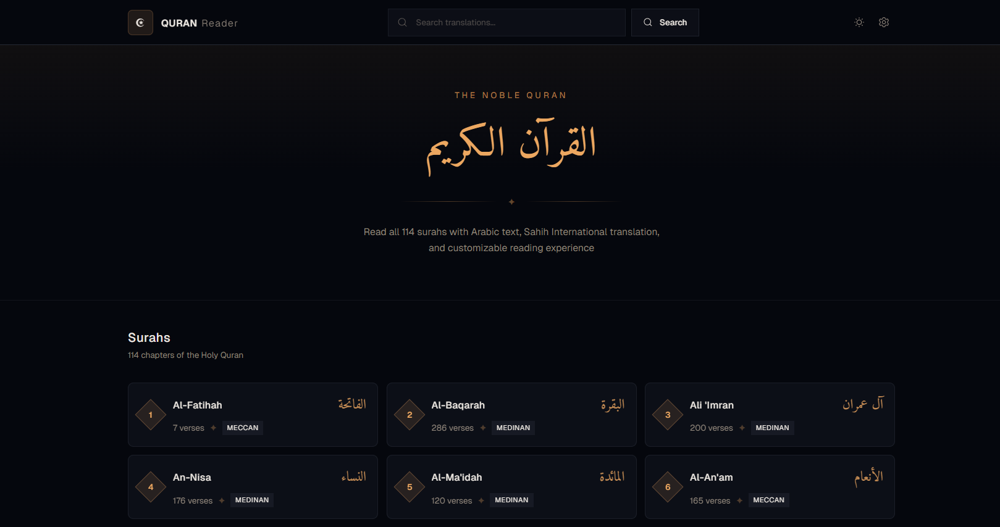

# Quran Web App

A modern, full-stack Quran reader application featuring Arabic text with English and Bengali translations, cross-language fuzzy search, customizable reading settings, and a sacred manuscript-inspired dark theme.



**Live:** [Frontend](https://tilawat-quran.vercel.app) | [Backend API](https://quran-web-app-api.vercel.app)

> **Reviewing this project?** Jump to [Run Locally](#run-locally) for the complete setup guide - clone, install, and run in under 2 minutes.

## Table of Contents

- [Features](#features)
- [Tech Stack](#tech-stack)
- [Project Structure](#project-structure)
- [Run Locally](#run-locally)
- [API Endpoints](#api-endpoints)
- [Deploying Hono to Vercel - The ESM Struggle](#deploying-hono-to-vercel---the-esm-struggle)

## Features

- **Browse all 114 Surahs** - Grid layout with surah name, type (Meccan/Medinan), and verse count
- **Read with dual text** - Arabic text alongside English or Bengali translation
- **Multi-language support** - Switch between English (Sahih International) and Bengali translations instantly - both pre-fetched at build time for zero-latency switching
- **Cross-language fuzzy search** - Search in English or Bengali regardless of your active language setting, powered by Fuse.js with dual-index matching
- **Customizable reading** - Choose Arabic font (Amiri or Scheherazade New), adjust font sizes for Arabic and translation text independently
- **Dark/Light/System theme** - Toggle between themes with persistent preference
- **Responsive design** - Optimized for desktop, tablet, and mobile
- **Sacred manuscript aesthetic** - Deep midnight theme with warm gold accents and geometric motifs
- **Persistent settings** - Reading preferences saved to localStorage via `useSyncExternalStore`
- **Static generation** - All 114 surah pages are pre-rendered at build time for instant loading
- **Optimized data lookups** - Pre-built hash maps for O(1) translation lookups instead of O(n) array scanning

## Tech Stack

### Frontend

- **Next.js 16** (Turbopack) - React framework with App Router
- **React 19** - UI library
- **TypeScript** - Strict type safety
- **Tailwind CSS v4** - Styling
- **shadcn/ui** - UI component library
- **Radix UI** - Accessible primitives
- **next-themes** - Theme management
- **Hugeicons** - Icon library

### Backend

- **Hono** - Lightweight, fast backend framework built on web standards
- **Bun** - JavaScript runtime for local development
- **Fuse.js** - Fuzzy search engine
- **TypeScript** - Strict type safety

### Infrastructure

- **pnpm workspaces** - Monorepo dependency management
- **Vercel** - Frontend and backend hosting
- **concurrently** - Simultaneous dev server management

## Project Structure

```text
Quran-web-app/
├── app/                    # Next.js App Router pages
│   ├── page.tsx            # Home - all surahs grid
│   ├── surah/[id]/         # Dynamic surah reader page
│   └── search/             # Search page
├── components/
│   ├── ayah/               # Verse display components
│   ├── surah/              # Surah card/list components
│   ├── search/             # Search input/results
│   ├── settings/           # Reading settings panel
│   ├── layout/             # Header, footer
│   └── ui/                 # shadcn/ui primitives
├── hooks/                  # Custom React hooks
├── lib/
│   ├── api/                # Backend API fetch functions
│   ├── types/              # TypeScript interfaces
│   ├── constants.ts        # App-wide constants
│   └── utils.ts            # Utility functions
├── providers/              # React context providers
├── server/                 # Hono backend (pnpm workspace)
│   ├── src/
│   │   ├── index.ts        # App entry point
│   │   ├── dev.ts          # Local Bun dev server
│   │   ├── routes/         # API route handlers
│   │   ├── services/       # Business logic
│   │   ├── types/          # Backend types
│   │   └── data/           # Quran JSON data
│   ├── vercel.json         # Backend deployment config
│   ├── package.json
│   └── tsconfig.json
├── pnpm-workspace.yaml     # Workspace config
└── package.json            # Root package.json
```

## Run Locally

Want to test the app on your machine? Follow these steps:

### Prerequisites

- **Node.js** >= 20
- **pnpm** >= 9
- **Bun** >= 1.0 (for backend)

### Setup

```bash
# 1. Clone the repository
git clone https://github.com/Abubokkor98/Quran-web-app.git
cd Quran-web-app

# 2. Install all dependencies (frontend + backend)
pnpm install

# 3. Create environment file
cp .env.example .env.local
# Or manually create .env.local with:
# NEXT_PUBLIC_BACKEND_URL=http://localhost:3001

# 4. Start both servers
pnpm dev
```

This starts:

- **Frontend** at `http://localhost:3000`
- **Backend** at `http://localhost:3001`

Both servers run with hot reload.

### Individual Commands

```bash
# Frontend only
pnpm dev:frontend

# Backend only
pnpm dev:server

# Type checking
pnpm typecheck            # Frontend
cd server && pnpm typecheck  # Backend

# Linting
pnpm lint

# Formatting
pnpm format

# Production build (frontend)
pnpm build

# Production build (backend)
cd server && pnpm build
```

## API Endpoints

| Method | Endpoint                         | Description                                              |
| ------ | -------------------------------- | -------------------------------------------------------- |
| `GET`  | `/`                              | API info and available endpoints                         |
| `GET`  | `/api/chapters`                  | Get all 114 chapters (metadata)                          |
| `GET`  | `/api/chapters/:id`              | Get a single chapter with all verses                     |
| `GET`  | `/api/chapters/:id?lang=bn`      | Get a chapter with Bengali translations                  |
| `GET`  | `/api/search?q={query}`          | Fuzzy search through verse translations (both languages) |
| `GET`  | `/api/search?q={query}&lang=bn`  | Search with Bengali translation results                  |

## Deploying Hono to Vercel - The ESM Struggle

Deploying the Hono backend to Vercel turned out to be a surprisingly deep rabbit hole that's worth documenting for anyone facing the same issue.

### The Problem

Everything worked perfectly in local development with Bun. But the moment we deployed to Vercel, the serverless function crashed with:

```text
Error [ERR_MODULE_NOT_FOUND]: Cannot find module '/var/task/server/src/routes/chapters'
imported from /var/task/server/src/index.js
```

### Why This Happens

When `"type": "module"` is set in `package.json`, Node.js enforces **strict ESM rules**. The key issue: Node.js ESM requires explicit `.js` file extensions in all relative imports.

TypeScript compiles `.ts` to `.js` but preserves import paths as-is. So `import from "./routes/chapters"` in TypeScript becomes `import from "./routes/chapters"` in the compiled JavaScript - and Node.js can't resolve it without the `.js` extension.

Bun auto-resolves missing extensions. Node.js (which Vercel uses in production) does not.

### What We Tried

| Attempt                                                  | Result                                                                                         |
| -------------------------------------------------------- | ---------------------------------------------------------------------------------------------- |
| **Zero-config Hono** (`export default app`)              | Vercel detected Hono but hit `ERR_MODULE_NOT_FOUND` at runtime                                 |
| **`hono/vercel` adapter** (`export default handle(app)`) | Same ESM module resolution error                                                               |
| **`@vercel/node` with `builds` config**                  | `@vercel/node` transpiles but doesn't bundle - same error                                      |
| **Adding `.js` extensions** to all imports               | Works, but looks wrong in TypeScript and confuses contributors                                 |
| **Bundling with tsup** to a single `dist/index.js`       | Build worked locally, but `builds` and `buildCommand` in `vercel.json` conflicted - 404 errors |
| **tsup with `postinstall` hook**                         | Timing issue - `dist/index.js` wasn't ready when Vercel's `builds` tried to process it         |

### The Solution

After trying six different approaches, the answer was surprisingly simple - one line in `server/vercel.json`:

```json
{
  "build": {
    "env": {
      "VERCEL_EXPERIMENTAL_BACKENDS": "1"
    }
  }
}
```

Despite the "experimental" name, this is Vercel's **official backend support flag** for modern TypeScript frameworks. It enables improved module resolution that handles extensionless imports, path aliases, and more - exactly what Node.js ESM breaks.

This lets us keep clean TypeScript without:

- Polluting imports with `.js` extensions
- Adding a bundler dependency
- Complex `vercel.json` build configurations
- Restructuring the project

### Key Takeaway

Vercel's "zero-config Hono" support works great for **single-file** apps. For **multi-file TypeScript** projects with relative imports, you need `VERCEL_EXPERIMENTAL_BACKENDS=1`. This isn't well documented and cost us hours of debugging - hopefully this saves someone else the trouble.
